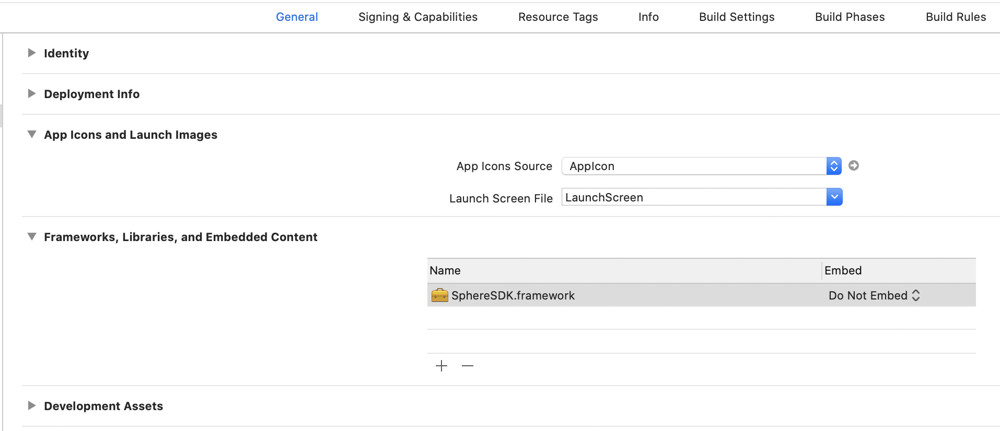
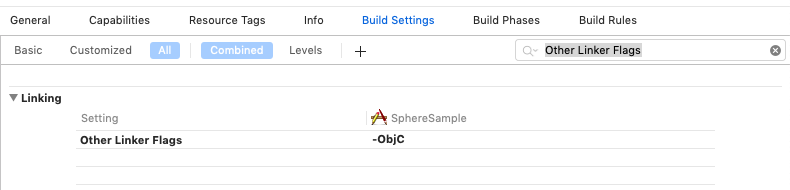

# Sphere iOS SDK

* [기본 연동](#기본-연동)
  * [Sphere Analytics 시작하기](#sphere-analytics-시작하기)
  * [샘플 소스 및 연동 검증 가이드](#샘플-소스-및-연동-검증-가이드)
  * [SDK 다운로드](#sdk-다운로드)
  * [Xcode 프로젝트 설정](#xcode-프로젝트-설정)
  * [SDK 초기화하기](#sdk-초기화하기)
  * [SphereBridge 설정](#spherebridge-설정)
* [추가 설정](#추가-설정)
  * [로그 출력](#로그-출력)
  * [이벤트 즉시 전송](#이벤트-즉시-전송)
  * [이벤트 수집 비활성화](#이벤트-수집-비활성화)
  * [Sphere ID 확인](#sphere-id-확인)
* [Push 연동](#push-연동)
  * [Notification Service Extension](#notification-service-extension)
  * [FCM 등록 토큰 설정](#fcm-등록-토큰-설정)
  * [푸시 알림 리스너 등록](#푸시-알림-리스너-등록)
  * [APNs 디바이스 토큰 설정](#apns-디바이스-토큰-설정)
* [푸시메시지 데이터 전달](#푸시메시지-데이터-전달)

## 기본 연동

> SDK 기본 연동은 이벤트 수집을 위한 필수 연동 사항이며 보다 정확한 이벤트 분석 및 트래킹을 위해서는 기본 연동에 포함된 가이드 중 해당되는 모든 항목들의 연동이 필요합니다.

### Sphere Analytics 시작하기

Sphere Analytics 사용을 위해서는 기본적으로 앱키(App key)가 필요합니다.  
앱키가 없는 경우 Sphere Analytics 콘솔([https://analytics.tand.kr](https://analytics.tand.kr), Chrome 브라우저 활용)을 방문하여 회원 가입 및 로그인 후 앱등록 단계에서 앱키를 발급받습니다.

### 샘플 소스 및 연동 검증 가이드

* [SDK 샘플 소스](sample) : 최신 버전의 Sphere SDK가 연동된 샘플 소스를 확인할 수 있습니다.
* [SDK 연동 검증 가이드](https://github.com/tand-git/sphere-sdk/blob/master/guide/SDK_Inspection.md) : 기본 연동이 완료되었다면 SDK 연동 검증 가이드에 따라 SDK 동작 상태를 확인할 수 있습니다.

### SDK 다운로드

SDK 라이브러리를 다운로드하기 위해서는 [SDK 다운로드 페이지](https://github.com/tand-git/ios-sdk/releases)를 방문하면 현재까지 릴리즈된 SDK 버전들을 확인할 수 있으며 가장 최신 버전의 SDK 파일(SphereSDK.framework.zip)을 선택하여 다운로드 후 압축을 해제합니다.

### Xcode 프로젝트 설정

1. 프로젝트 폴더 내에 Sphere SDK framework 파일(.framework)을 복사합니다.
2. 해당 프로젝트 내에 framework 파일을 추가합니다. (Add Files to ...)
3. '프로젝트 설정 > General > Linked Frameworks and Libraries' 에서 'SphereSDK.framework'가 추가되었는지 확인 후
만약 추가되지 않은 경우 'Linked Frameworks and Libraries > 추가(+) > Add Other...'를 통해 'SphereSDK.framework'를 추가합니다.

4. '프로젝트 설정 > General > BuildSettings > Linking > Other Linker Flags' 설정에 '-ObjC'를 추가합니다.  


### SDK 초기화하기

Sphere SDK 라이브러리를 프로젝트에 추가하였다면 다음 코드와 같이 앱키와 함께 Sphere SDK를 초기화합니다.  
앱키가 없는 경우 [Sphere Analytics 시작하기](#sphere-analytics-시작하기)을 참고하여 앱키를 발급받습니다.

`<Objective-C> - AppDelegate.m`

```objectivec
@import SphereSDK;

@implementation AppDelegate

- (BOOL)application:(UIApplication *)application didFinishLaunchingWithOptions:(NSDictionary *)launchOptions {

    // Sphere Analytics SDK 초기화
    [SPRAnalytics configureWithAppKey:@"Your Sphere Analytics App Key"];

    return YES;
}

@end
```

### SphereBridge 설정
1. [SDK for ReactNative 다운로드 페이지]()에서 SphereBridge.h, SphereBridge.m 파일을 다운받아 프로젝트에 추가합니다. 

## 추가 설정

> 추가 설정은 필수적인 연동 사항은 아니며 필요한 경우 선택적으로 사용이 가능합니다.

### 로그 출력

로그 출력 함수를 활성화 하면 세션의 시작과 종료 및 이벤트 기록 로그와 에러 로그들을 확인할 수 있습니다.  
기본 설정은 비활성화 상태이며 출력되는 로그들은 [SDK 로그를 통한 검증](#sdk-로그를-통한-검증)에서 확인 가능합니다.

`<Objective-C>`

```objectivec
[SPRAnalytics enableLog:true]; // 활성화
```

### 이벤트 즉시 전송

기본적으로 Sphere Analytics는 앱이 실행된 후 비활성화되는 시점에 자동으로 기록된 모든 이벤트들을 서버에 전송합니다.  
하지만 `requestUpload` 함수를 호출할 경우 호출 시점까지 기록된 모든 이벤트들을 즉시 서버로 전송이 가능하며 해당 시점에 즉시 이벤트 수집이 필요한 경우에만 사용하기를 권장합니다.

`<Objective-C>`

```objectivec
[SPRAnalytics requestUpload];
```


### 이벤트 수집 비활성화

Sphere Analytics의 이벤트 수집 기능을 비활성화하기를 원할 경우 아래와 같은 코드를 추가합니다.
기본 설정은 활성화 상태이며 비활성화된 이후로는 다시 활성화하기 전까지 이벤트가 수집되지 않습니다.

`<Objective-C>`

```objectivec
[SPRAnalytics setAnalyticsCollectionEnabled:false]; // 비활성화
```

### Sphere ID 확인

Sphere ID는 Sphere에서 기기를 식별하는 고유한 식별자로서 앱 설치 시 SDK 내부에서 항상 새롭게 생성이 되므로 삭제 후 재설치 시 새로운 Sphere ID가 생성이 됩니다.  
Sphere ID를 확인하기 위해서는 `sphereId` 함수를 호출하여 SDK로부터 Sphere ID를 가져온 후 로그를 출력하여 확인할 수 있습니다.

`<Objective-C>`

```objectivec
NSString *sphereId = [SPRAnalytics sphereId];
NSLog(@"Sphere ID: %@", sphereId);
```


## Push 연동

> 푸시 메시지 기능을 사용하기 위해서는 Sphere SDK 연동가이드의 기본 연동 및 FCM(Firebase Cloud Messaging) 클라이언트 앱 설정이 필수적으로 완료되어야 메시지 수신이 가능합니다.

* [Sphere SDK iOS 연동가이드](https://github.com/tand-git/sdk-for-react-native/tree/master/ios) : [기본 연동](https://github.com/tand-git/sdk-for-react-native/tree/master/ios#기본-연동)
* [iOS 기반 FCM(Firebase Cloud Messaging) 클라이언트 앱 설정](https://firebase.google.com/docs/cloud-messaging/ios/client)

SDK 기본 연동 및 푸시 메시지 연동이 모두 완료된 샘플 프로젝트는 아래 샘플 소스 참조 사이트에서 확인이 가능합니다.  
샘플 프로젝트를 통해 단말에서 메시지 전송 테스트를 하기 위해서는 Firebase 콘솔에서 샘플앱 프로젝트를 생성 후 발급받은 `GoogleService-Info.plist` 파일로 교체해야 테스트가 가능합니다.

* 샘플 소스: [https://github.com/tand-git/ios-sdk/tree/master/message/sample](https://github.com/tand-git/ios-sdk/tree/master/message/sample)

### Notification Service Extension

> 이미지를 포함한 푸시 메시지 수신 시 이미지를 알림창에 표시하기 위해서는 Xcode 프로젝트에 [Notification Service Extension](https://developer.apple.com/documentation/usernotifications/unnotificationserviceextension)을 추가해야 합니다.  
> 앱에서 이미 FCM을 통해 전달된 푸시 메시지의 이미지를 표시하고 있거나 이미지를 포함한 푸시 메시지를 사용하지 않을 경우 추가 연동은 필요하지 않습니다.

자세한 사항은 아래에 나와있는 Firebase의 클라우드 메시징 가이드 및 Apple 개발자 문서를 통해 확인이 가능하며 실제 구현된 샘플은 Sphere 푸시 메시지 샘플 프로젝트에서도 참고할 수 있습니다.

* [(Firebase) Set up the notification service extension](https://firebase.google.com/docs/cloud-messaging/ios/send-image#set_up_the_notification_service_extension)
* [(Apple Developer) Modifying Content in Newly Delivered Notifications](https://developer.apple.com/documentation/usernotifications/modifying_content_in_newly_delivered_notifications)
* [Sphere 푸시 메시지 샘플 소스](sample)

### FCM 등록 토큰 설정

> FCM(Firebase Cloud Messaging)을 통해 푸시 메시지를 전송하기 위해서는 FCM 등록 토큰이 필요합니다.

Firebase의 `FIRMessagingDelegate`를 통해 전달되는 FCM 토큰을 Sphere SDK에 전달해야 합니다.

`<Objective-C> - AppDelegate.m`

```objectivec
@import SphereSDK;
@import Firebase;

@interface AppDelegate () <FIRMessagingDelegate>
@end

@implementation AppDelegate

- (void)messaging:(FIRMessaging *)messaging didReceiveRegistrationToken:(NSString *)fcmToken {

    ...
    // Notify about received token.
    NSDictionary *dataDict = [NSDictionary dictionaryWithObject:fcmToken forKey:@"token"];
    [[NSNotificationCenter defaultCenter] postNotificationName:
     @"FCMToken" object:nil userInfo:dataDict];
     
    // Sphere SDK 푸시 토큰 설정
    [SPRPushMessage setFcmToken:fcmToken];
}

@end
```

### 푸시 알림 리스너 등록

> 푸시 알림 리스너 등록 설정이 연동되지 않을 경우 Sphere 콘솔에서 "메시지 오픈"에 대한 통계 데이터가 부정확할 수 있습니다.

앱 시작 시 푸시 알림 리스너를 등록하고 푸시 메시지 수신 및 클릭 시 실행되는 해당 메소드에서 전달된 `UNNotification` 또는 `UNNotificationResponse` 객체를 Sphere SDK로 전달해야 합니다.


AppDelegate.h 파일에 import 2가지와 interface에 아래와 같이 변경합니다.

`<Objective-C> - AppDelegate.h`
```objectivec

#import <UserNotifications/UNUserNotificationCenter.h>
@import Firebase;

@interface AppDelegate : UIResponder <UIApplicationDelegate, RCTBridgeDelegate, UNUserNotificationCenterDelegate,FIRMessagingDelegate>
```

AppDelegate.m 파일에 import 4개를 추가하고 아래의 코드들을 참조하여 적용합니다.

`<Objective-C> - AppDelegate.m`

```objectivec

#import <UserNotifications/UserNotifications.h>
#import <RNCPushNotificationIOS.h>
@import SphereSDK;
@import Firebase;

@interface AppDelegate ()
@end

@implementation AppDelegate

- (BOOL)application:(UIApplication *)application didFinishLaunchingWithOptions:(NSDictionary *)launchOptions {
    ...
    ...

    // 푸시 알림 리스너 등록 (UNUserNotificationCenterDelegate)
     UNUserNotificationCenter *center = [UNUserNotificationCenter currentNotificationCenter];
  center.delegate = self;

    // Firebase SDK 초기화
    [FIRApp configure];
    [FIRMessaging messaging].delegate = self;

    // Sphere SDK 초기화
    [SPRAnalytics configureWithAppKey:@"Your Sphere SDK App Key"];

    // Sphere 푸시 메시지 데이터 처리
    NSDictionary *userInfo = [launchOptions objectForKey:UIApplicationLaunchOptionsRemoteNotificationKey];
    if (userInfo) {
        [SPRPushMessage handleReceiveNotificationUserInfo:userInfo];
    }

    return YES;
}


- (void)userNotificationCenter:(UNUserNotificationCenter *)center
       willPresentNotification:(UNNotification *)notification
         withCompletionHandler:(void (^)(UNNotificationPresentationOptions))completionHandler {

    if ([SPRPushMessage isSphereNotification:notification]) {
        // Sphere 푸시 메시지 데이터 처리
        [SPRPushMessage handlePresentNotification:notification];

    } else {
        // Sphere 푸시 메시지가 아닌 경우 처리
    }

    // 앱 실행 중 푸시 메시지 수신 시 알림창 표시 옵션 설정(변경 가능)
    completionHandler(UNNotificationPresentationOptionSound | UNNotificationPresentationOptionAlert | UNNotificationPresentationOptionBadge);
}

- (void)userNotificationCenter:(UNUserNotificationCenter *)center
didReceiveNotificationResponse:(UNNotificationResponse *)response
         withCompletionHandler:(void(^)(void))completionHandler {

    if ([SPRPushMessage isSphereNotificationResponse:response]) {
        // Sphere 푸시 메시지 데이터 처리
        [SPRPushMessage handleReceiveNotificationResponse:response];

    } else {
        // Sphere 푸시 메시지가 아닌 경우 처리
    }
    [RNCPushNotificationIOS didReceiveNotificationResponse:response];
    completionHandler();
}

- (void)application:(UIApplication *)application
    didReceiveRemoteNotification:(NSDictionary *)userInfo
          fetchCompletionHandler:
              (void (^)(UIBackgroundFetchResult))completionHandler {
  [RNCPushNotificationIOS didReceiveRemoteNotification:userInfo
                                fetchCompletionHandler:completionHandler];
}

- (void)application:(UIApplication *)application
    didFailToRegisterForRemoteNotificationsWithError:(NSError *)error {
  [RNCPushNotificationIOS
      didFailToRegisterForRemoteNotificationsWithError:error];
}

@end
```

### APNs 디바이스 토큰 설정

> 사용자의 언인스톨 정보를 집계하기 위해서는 APNs 디바이스 토큰 설정 연동이 필요합니다.

앱이 실행되고 Remote Notifcaion이 등록된 후 호출되는 `didRegisterForRemoteNotificationsWithDeviceToken`를 재정의하여 `deviceToken`을 Sphere SDK에 설정합니다.

`<Objective-C> - AppDelegate.m`

```objectivec
@implementation AppDelegate

- (void)application:(UIApplication *)application didRegisterForRemoteNotificationsWithDeviceToken:(NSData *)deviceToken {

    // Sphere SDK APNs 디바이스 토큰 설정
    [SPRPushMessage setAPNSDeviceToken:deviceToken];
  [RNCPushNotificationIOS didRegisterForRemoteNotificationsWithDeviceToken:deviceToken];
}

@end
```

## 푸시메시지 데이터 전달

> 푸시 메시지 전송 시 데이터(키/값)를 함께 전달하기 위해서는 [키-값 이용 가이드](https://www.notion.so/Key-value-c65b4843b7cd4b6e80e91ad994af52b2)를 참고하여 Sphere 콘솔에서 푸시메시지 입력 시 키/값을 설정해야 합니다.

데이터(키/값)와 함께 푸시메시지를 전송하면 메시지 클릭 시 실행되는 `AppDelegate`로 데이터가 전달됩니다.  
만약 링크를 통해 앱 내 특정 페이지로 이동할 경우 링크에 해당하는 키/값이 `AppDelegate`로 전달되면 해당 링크를 확인하여 링크 페이지로 이동하는 코드를 구현해야 합니다.


`<Objective-C> - AppDelegate.m`

```objectivec
@implementation AppDelegate

- (BOOL)application:(UIApplication *)application didFinishLaunchingWithOptions:(NSDictionary *)launchOptions {

    // 푸시메시지 커스텀 데이터 전달 처리
    NSString *yourPushLinkKey = @"key_your_push_link";
    NSDictionary *userInfo = [launchOptions objectForKey:UIApplicationLaunchOptionsRemoteNotificationKey];
    if (userInfo[yourPushLinkKey]) {
        NSString *link = userInfo[yourPushLinkKey];
        // 링크 페이지로 이동
    }

    return YES;
}

- (void)userNotificationCenter:(UNUserNotificationCenter *)center
didReceiveNotificationResponse:(UNNotificationResponse *)response
         withCompletionHandler:(void(^)(void))completionHandler  {

    // 푸시메시지 커스텀 데이터 전달 처리
    NSString *yourPushLinkKey = @"key_your_push_link";
    NSDictionary *userInfo = response.notification.request.content.userInfo;
    if (userInfo[yourPushLinkKey]) {
        NSString *link = userInfo[yourPushLinkKey];
        // 링크 페이지로 이동
    }
    [RNCPushNotificationIOS didReceiveNotificationResponse:response];
    completionHandler();
}

@end
```